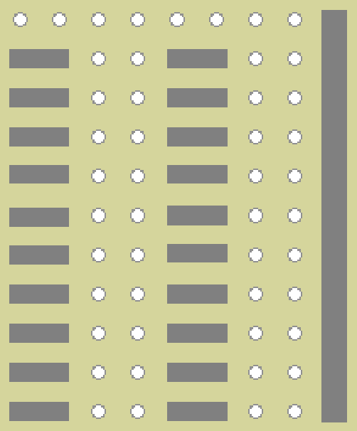
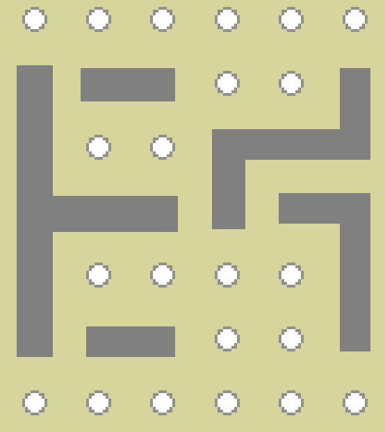

# Pihole-Activity

A Python project that manages an LED bar graph and two activity LED on a Raspberry Pi

## Getting Started

This project’s goal is to enclose a pi-hole server in a project box with added activity lights in the front panel. This project requires a raspberry pi with pi-hole already setup on it.

## Bill of material

### For the final build

| Description | Link | Quantity | Price |
| ----------- | ---- | -------- | ----- |
| 10 segments red LED Bar Graph | [AliExpress](https://www.aliexpress.com/item/32811943871.html?spm=a2g0o.productlist.0.0.385757df1b2Lr8&algo_pvid=81b6ea2e-bbe1-4634-9305-ca7d9543ac35&algo_expid=81b6ea2e-bbe1-4634-9305-ca7d9543ac35-16&btsid=0844ca98-45f0-41d7-bb55-1833f7978391&ws_ab_test=searchweb0_0,searchweb201602_7,searchweb201603_55) | 1 | $0.88 |
| Red LED | | 1 | |
| Green LED | | 1 | |
| 220Ω resistor | | 12 | |
| Single Row Right Angle Pin Header | | 11 | |
| Single Row Pin Header | | 3 | |
| Female to Female Jumper wires* | | 14 | |
| PerfBoard | | 1 | |
| 115x80x40 Project Box** | | 1 | |

*Ideally look for jumper cable in ribbon style so you can keep bundles together for each circuit.
**The size provided is based on a Raspberry Pi Zero W with an ethernet to micro USB adapter. I suggest you draw everything to size and make sure everything fits before commiting to a project box size.

### For prototyping

If it's not your first Raspberry Pi project, you should have most of these item. They will not be permanent to the build and will be reusable afterward.

| Description | Link | Quantity | Price |
| ----------- | ---- | -------- | ----- |
| Male-to-Male Jumper wires |  | 16 |  |
| BreadBoard |  | 1 |  |
| Raspberry Pi GPIO Extender Shield* |  | 1 |  |
| BreadBoard power supply1 |  | 1 |  |

*These two elements are optional, but helps a lot in the prototyping phase.

### General 

This list of item are purely equipment that will be need to do the build like I did. You can use any other methods of your likng to get to the same result.

- Soldering Iron
- Solde
- Flux
- Helping hand
- Electric drill
- Exacto
- Hot Glue Gun

### Raspberry Pi equipment

This is the Raspberry Pi that was used for my build. Any other Raspberry Pi could work for the build, but the size and way the wiring was made is based on this form factor.

- Raspberry Pi Zero W
- Ethernet to micro USB adapter
- 5v 2.5a micro USB power supply
- 32 Gb micro SD card
- 20x2 Pin Header (optionnal, but will simplify the connection to the Raspberry Pi Zero)*

*This part is not required but will make any upgrade or changes to the build much easier down the line, as you will not be soldering the jumper wires directly to the board itself.

## Circuit Board

This section will review the electronic components of the build. It will explain how the system works, how to prototype, test and make the permanent modules for the build.

### Electric Diagram

The circuit is made of two distinct elements. First there is the LED Bar graph and second, the activity light module.
The first module takes the 3.3V rail of the Raspberry Pi and provide power to all 10 LED of the bar graph. Each LED of the bar graph are then connected to a GPIO. In this module, the light of the LED will be powered on when the output of the GPIO pin is set to LOW as the GPIO pin will act as a ground in that case. Inversely, the LED will be off if the GPIO output is set to HIGH.
The second module works in the opposite way. The LED positive is connected to the GPIO. The negative is connected to ground. In this module, the LED is powered on when the output of the GPIO pin is set to HIGH.

### BreadBoard Prototype

#### Testting the prototype

#### Troubleshooting

#### Running the scripts

### Permanent

#### LED Bar Graph Module

| Front | Back |
| --- | --- |
|  |  |

#### Activity LED Module

| Front | Back |
| --- | --- |
|  |  |

## Installation

## Author

- Felix Cusson - [Darkfull-Dante](https://github.com/Darkfull-Dante)